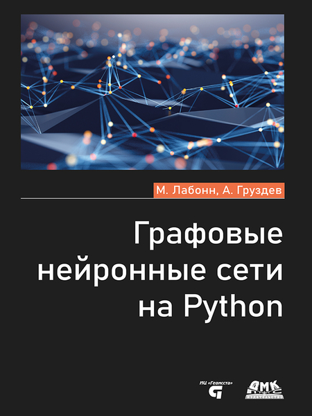

# Графовые нейронные сети на Python

Этот репозиторий содержит программный код к книге "Графовые нейронные сети на Python" [Максима Лабонна](https://github.com/mlabonne) и [Артема Груздева](https://t.me/Gewissta).

[Данные к главе 16](https://drive.google.com/file/d/1VaFMANRD1mskzs3hUuIIHXJh7tE7v12W/view?usp=sharing)

## Опечатки
Всю информацию по опечаткам отправляйте на [электронную почту](mailto:info@gewissta.ru). Если есть проблемы с кодом, пользуйтесь кнопкой [New Issue](https://github.com/Gewissta/GNN/issues/new/choose) раздела Issues.

## Список найденных опечаток:

## Список исправлений программного кода:

